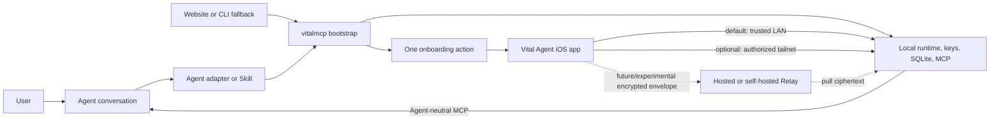

# Agent-First Onboarding And Runtime Bootstrap

This document defines the target installation and onboarding experience for Vital Agent Sync. It replaces the assumption that the website and a shell command are the product entry point. The preferred entry point is an existing Agent conversation; the website and CLI remain portable fallbacks.

Related work:

- [GitHub issue #54](https://github.com/Coooder-Crypto/health-link/issues/54) owns the shared installer and bootstrap contract.
- [GitHub issue #57](https://github.com/Coooder-Crypto/health-link/issues/57) owns optional OpenClaw marketplace publication and smoke testing.
- [GitHub issue #55](https://github.com/Coooder-Crypto/health-link/issues/55) owns physical-device validation of QR, deep-link, sync, pull, and MCP behavior.
- [GitHub issue #56](https://github.com/Coooder-Crypto/health-link/issues/56) owns the real Hosted Relay production deployment.

## Product Decision

Vital Agent Sync is not an OpenClaw-only skill and it is not a shell installer with an iOS companion. It is four replaceable layers:

```text
Vital Agent iOS app source
  -> encrypted transport
  -> vitalmcp context runtime
  -> Agent-neutral MCP
  -> Agent adapters and optional skills
```

The default product experience should be:

```text
Ask an Agent to install Vital Agent Sync
  -> review the setup plan
  -> let the Agent invoke the shared bootstrap
  -> receive one onboarding action
  -> connect the iOS app
  -> complete the first encrypted sync
  -> verify fresh data through MCP
```

The Agent can guide this flow, but it must not become the data plane. Removing an OpenClaw, Hermes, Codex, Claude, or future Agent adapter must not change relay cryptography, normalized storage, or MCP tools.

## Reference Product Alignment

The current [Apple Health Sync skill on ClawHub](https://clawhub.ai/lukasosterheider/skills/apple-health-sync) and [Health Sync product walkthrough](https://gethealthsync.app/) provide a useful interaction benchmark, but Vital Agent Sync runtime Preview does not depend on any marketplace listing:

1. The user starts inside an Agent conversation.
2. The Agent installs a Skill and initializes a local runtime.
3. The Agent offers one onboarding format, with QR preferred and a text form as fallback.
4. The user connects an iOS app and completes a first sync.
5. The local runtime fetches, decrypts, validates, and persists snapshots.
6. The Agent can generate summaries from the latest available sync.

Vital Agent Sync should align with that low-friction sequence, but not copy an Agent-specific runtime or duplicate the query layer in Skill scripts. Vital Agent Sync already has a reusable TypeScript runtime, E2EE relay protocol, SQLite ingest path, lifecycle controls, and 12 Agent-neutral MCP tools.

## Entry Surfaces

### 1. Agent Conversation (Preferred)

The user gives a supported Agent a Vital Agent Sync install URL or marketplace package. The adapter:

- explains the filesystem, service, network, and Agent-config changes before applying them
- invokes the shared `vitalmcp` bootstrap
- presents one onboarding action at a time
- verifies the first sync through MCP
- returns Agent-specific reload and scheduling guidance

OpenClaw and Hermes may provide first-class Skill packages. Other runtimes can invoke the same CLI and import standard MCP configuration.

### 2. CLI Or Website Command (Portable Fallback)

Users without a supported Agent installer use:

```bash
npx -y vitalmcp setup
```

The planned website bootstrap command may install the package into a user-writable prefix when Node/npm or global npm permissions are unsuitable:

```bash
curl -fsSL https://<healthlink-domain>/install.sh | sh
vitalmcp setup
```

The shell script is a distribution helper, not a second setup implementation. It must delegate product initialization to `vitalmcp setup`.

### 3. Mobile Agent Trigger

A mobile Agent may open a Vital Agent Sync universal/deep link after an Agent-side runtime has created onboarding state:

```text
Agent mobile app
  -> vitalmcp://onboard?... or an HTTPS universal link
  -> Vital Agent iOS app confirms the target and requested scopes
  -> Vital Agent Sync uploads ciphertext
  -> vitalmcp pulls, decrypts, and exposes MCP
```

Mobile Agent callbacks carry request ID and coarse status only. They never carry health payloads, private keys, bearer tokens, envelope bodies, or detailed errors.

## Target Architecture



LAN is the Local Preview default and requires only a reachable trusted network between the iPhone and receiver. Tailscale is the optional private remote path for users who install its apps, sign in to an account, and authorize both devices on the same tailnet. Neither path asks for a relay URL, VPS, domain, Vital Agent Sync account, or payment method. Hosted Relay remains future/experimental and is not recommended or required in Local Preview.

## Bootstrap Ownership

### Distribution Installer

The POSIX installer owns only package availability:

- detect macOS, Linux, and WSL
- verify a supported Node.js/npm environment, or explain the missing prerequisite
- install `vitalmcp` into a user-writable prefix without `sudo`
- use `~/.vitalmcp/npm-global` by default and support a pinned package version
- update a supported shell profile idempotently, without replacing unrelated content
- support a pinned package version
- print the exact next command
- support clean uninstall of installer-owned PATH entries

It must not generate relay keys, write Agent configuration, start services, or create onboarding credentials itself.

### `vitalmcp setup`

The shared runtime owns product initialization:

- detect the Agent adapter and service manager
- select LAN by default, or Tailscale after the user confirms its prerequisites
- keep Hosted Relay and self-hosted Relay behind an explicit future/experimental choice
- create and harden local state
- initialize or migrate keys and configuration
- install/start the local pull or receiver service
- install or print the same MCP server contract for every Agent
- create an onboarding artifact
- report the next user action
- resume safely after an interrupted setup
- verify the first sync and MCP freshness when requested

### Agent Adapter Or Skill

The Agent layer owns conversation orchestration only:

- invoke supported bootstrap/status/pull/lifecycle commands
- request explicit confirmation before persistent changes
- choose one onboarding presentation
- explain freshness and the next action
- explain freshness without promising an iOS delivery schedule
- call MCP tools for all health-data reads

It must not implement cryptography, parse HealthKit payloads, maintain a separate health database, or bypass MCP.

## Setup State Machine

Setup must be idempotent and resumable rather than a monolithic interactive script.

```text
detect
  -> plan
  -> user consent
  -> install runtime state
  -> configure Agent MCP
  -> start local service
  -> create onboarding handoff
  -> wait for first iOS sync
  -> pull and ingest
  -> verify MCP freshness
  -> ready
```

Each completed stage is persisted without storing plaintext tokens in logs. Re-running setup continues from the first incomplete stage unless the user explicitly requests reset or migration.

The implemented contract uses `schema_version: 1` and stores non-secret progress in `~/.healthlink/setup/state-v1.json` with user-only permissions. Persisted stages are:

```text
environment_checked
plan_created
consent_received
runtime_initialized
agent_configured
service_installed
service_started
onboarding_created
first_sync_observed
complete
```

Setup records the database sync count after consent and only marks `first_sync_observed` when the count increases, so existing history cannot be mistaken for the first sync from a new onboarding flow.

## CLI Contract

The existing interactive command remains the human fallback:

```bash
vitalmcp setup
```

The target Agent-facing contract should add stable non-interactive and machine-readable behavior, for example:

```bash
vitalmcp setup --agent auto --transport lan --output json
vitalmcp setup --resume --yes --output json
vitalmcp setup --agent auto --transport tailscale --tailscale-name <host.tailnet.ts.net> --output json
vitalmcp status --output json
```

Exact flags may follow existing CLI conventions, but the JSON schema must be versioned. Safe output includes:

- setup state and completed stages
- detected Agent and service manager
- transport mode and non-secret relay origin
- path to a locally rendered QR artifact
- whether MCP configuration changed
- reload hint
- first-sync and freshness status
- a stable error category and suggested next action

JSON, logs, and Agent messages must not include:

- private key material
- upload authentication secrets
- relay access tokens
- complete onboarding payloads
- raw health payloads
- raw SQLite rows

## Onboarding Artifact Security

The current E2EE onboarding payload contains sensitive long-lived source credentials. A QR or deep link containing that payload must be treated like a password, even when it is visually encoded.

V1 rules:

- prefer a local terminal/browser QR or local file rendered by the runtime
- never print decoded onboarding fields
- present only one format unless the user asks for a fallback
- do not persist QR images longer than necessary
- require explicit user intent before an Agent uploads a QR image to a cloud-hosted chat surface
- keep secret files private to the current user

Target follow-up:

- introduce a short-lived, single-use onboarding ticket before making in-chat QR/deep-link handoff the universal default ([issue #70](https://github.com/Coooder-Crypto/health-link/issues/70))
- bind the ticket to the intended user/source identity
- exchange it for device credentials once, then invalidate it
- keep long-lived relay and upload credentials out of conversation history

This preserves the competitor's simple Agent-to-app handoff without copying an avoidable credential-exposure boundary.

## Transport Defaults

The bootstrap chooses transport independently from the Agent adapter:

| Transport | Product role | Local inbound port | User infrastructure |
| --- | --- | --- | --- |
| Direct LAN | Local Preview default | Yes | Reachable trusted network |
| Tailscale | Optional private remote path | Yes | User-installed apps, account, and authorized tailnet |
| Public direct HTTPS | Advanced existing deployment | Yes | DNS, TLS, firewall |
| Hosted Relay | Future/experimental; not a Local Preview recommendation | No | Future hosted service |
| Self-hosted Relay | Experimental operator path | No on Agent machine | User-operated relay host |

The Agent must not silently switch transport modes. Migration preserves local history and requires new iOS onboarding when credentials or routing change.

The v0.1 sync promise is user-triggered Sync Now plus catch-up when the iOS app is active or returns to the foreground. Background opportunities are best-effort. Product and Agent copy must not promise scheduled daily/weekly delivery, an exact interval, or a guaranteed background time.

## Failure And Recovery UX

Every setup failure should report:

- the failed stage
- a stable error category
- a redacted one-line explanation
- whether retry is safe
- the exact next command or user action

Required recovery paths:

- package already installed
- unsupported or old Node.js
- npm global EACCES
- unknown Agent
- invalid Agent config
- service manager unavailable
- local port unavailable in direct mode
- Tailscale app, sign-in, authorization, or reachability failure
- experimental Relay unreachable
- stale or mismatched onboarding credentials
- first sync not completed
- MCP installed but Agent reload required
- expired LAN/Tailscale pairing QR: run `vitalmcp pair`
- source reset: call MCP `revoke_source_device`, remove the saved iOS connection, and pair again without deleting local SQLite history

Unknown Agents fall back to standard MCP JSON and never block setup.

## Acceptance Criteria

The Agent-first onboarding milestone is complete when:

- a supported Agent can start setup from one install URL or marketplace command
- the same bootstrap works through OpenClaw, Hermes, and generic MCP without Agent-specific data paths
- macOS and Linux installation succeeds without `sudo npm install -g`
- install and setup are idempotent and recover from interruption
- persistent changes require a visible plan and user consent
- LAN setup succeeds without a relay URL, VPS, domain, account, or payment method
- Tailscale setup states its app, account, and authorized-tailnet prerequisites before making changes
- the user sees one QR/deep-link/text action, not a dump of credential fields
- secrets and health plaintext are absent from Agent messages, JSON, logs, and support output
- first iOS sync is pulled and visible through `healthlink_status` plus the standard MCP tools
- removing an optional Skill does not remove local data or break MCP
- generic MCP remains usable without an Agent marketplace listing
- product copy promises manual sync plus foreground catch-up, with background delivery best-effort and unscheduled
- automated tests cover installer EACCES fallback, shell-profile idempotency, Agent detection, setup resume, output redaction, and unknown-Agent fallback

## Non-Goals

This milestone does not:

- deploy the production Hosted Relay
- publish the OpenClaw package itself
- add new HealthKit metrics or scope controls
- implement strict real-time iOS background sync
- make Skill installation mandatory for generic MCP clients
- allow an Agent to read HealthKit or relay plaintext directly

## Delivery Slices

1. **Bootstrap contract**: versioned setup state, JSON output, resume behavior, redaction, and first-sync verification.
2. **Distribution installer**: user-prefix npm install, PATH management, platform detection, uninstall, and CI fixtures.
3. **Agent adapters**: OpenClaw, Hermes, and generic MCP orchestration against the same bootstrap contract.
4. **Website entry**: platform-aware fallback commands and links to Agent-specific entry points.
5. **Secure handoff follow-up**: short-lived, single-use onboarding tickets for safe in-chat QR/deep-link delivery.

Slices 1–4 belong to issue #54. Slice 5 is tracked in issue #70. OpenClaw marketplace publication remains isolated in issue #57 so the Agent-neutral product does not depend on ClawHub.
